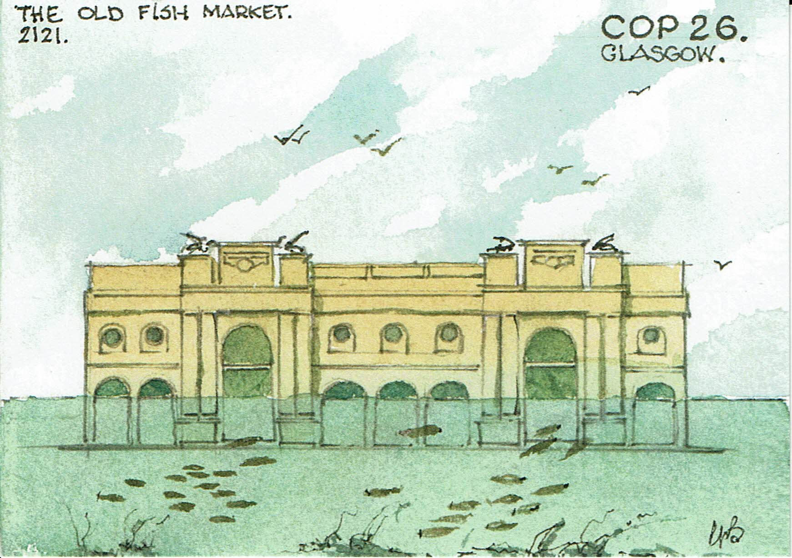

To mark the Climate Change Conference ‘COP26’ which will be held in Glasgow from31 October to 12 November 2021.One of our members, Andrew Black, has designed a set of four postcards showing what Glasgow wouild be like in 2121 if sea levels continue to rise - very much tongue in cheek 
It is understood that Royal Mail are not planning any special postmarks for the event. However, we hope that you will find ways of publicising the event (and our hobby) through these cards. Postcards are available in sets of 4 for £1.50 per set plus a flat charge of £1 p&p. Orders should be sent to our President, Maureen Mathieson, who will organise despatch - maureen.mathieson@gmail.com (01355 235121).

