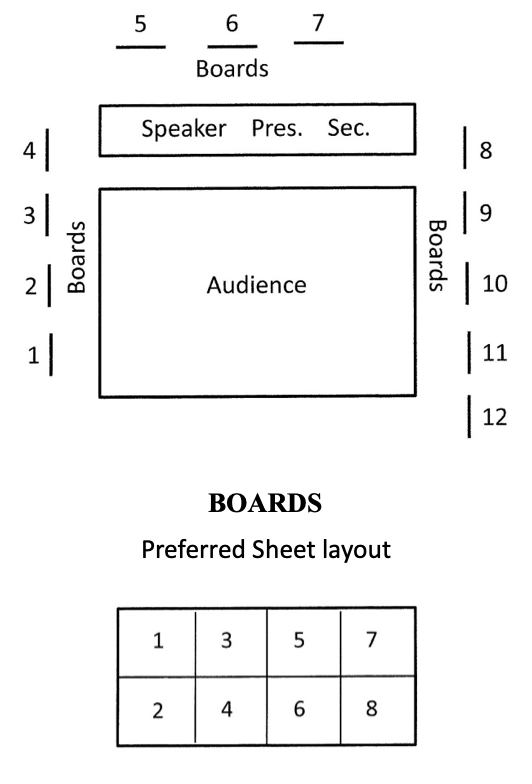

# Advice for visiting speakers

[Current Syllabus](./meetings) / [Previous Meetings](./previous-meetings)

Meetings are held in Room GH542 in the Graham Hills Building, Strathclyde University, at 7.30 pm. Please see overleaf for directions. For speakers requiring overnight accommodation rooms can be booked in a Premier Inn Hotel (Glasgow City Centre George Square) which is situated close to our meeting place.

**Format:** displays are usually two rounds of 96 sheets each, arranged on 12 boards holding eight sheets (up to A4 size) as shown in the diagrams below. The frames stand on tables, which gives little space to lay out oversize sheets or any items of ephemera that do not readily sit on display frames; separate tables can be provided for such items to be shown.

Our meeting room is quite large and we provide a microphone and speaker system to ensure that speakers can be heard. We recommend that speakers put up their sheets and then speak about them from the front of the room, if possible.

### Meeting timetable for Evening  and Afternoon/Joint Meetings

(Approximate suggested times)

Agenda Item  | Time | Time
----- | -------  | --------
Meeting opens | 7.30 pm | 1.30 pm
Society Business | 7.30-7.40 | 1.30 - 1.35
Talk on first round | 7.40-7.55 | 1.35 - 1.50
Viewing first round | 7.55-8.25 | 1.50 - 2.10 
Tea served | 8.10 | 1.50
Talk on second round | 8.30-8.45 | 2.10 - 2.25
Viewing second round | 8.45-9.15 | 2.25 - 2.45
Vote of thanks/close | 9.15 | 2.45

Sheets from the first round can be taken down and replaced by the sheets for the second round at about 8.25 or 2.00 as appropriate. Members will provide assistance with taking sheets down if required.

## Room Layout

Room layout for Partick Burgh Hall is basically the same but orientation may vary. 12 boards are used at each venue.

## Directions

View the [location](./location.md) page for details.
