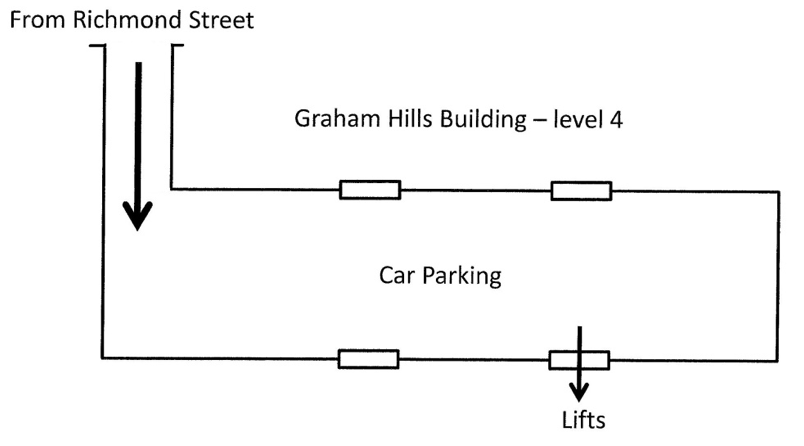

## Meetings



### Advice for visiting speakers

Meetings are held in Room GH542 in the Graham Hills Building, Strathclyde University, at 7.30 pm. Please see overleaf for directions. For speakers requiring overnight accommodation rooms can be booked in a Premier Inn Hotel (Glasgow City Centre George Square) which is situated close to our meeting place.

**Format:** displays are usually two rounds of 96 sheets each, arranged on 12 boards holding eight sheets (up to A4 size) as shown in the diagrams below. The frames stand on tables, which gives little space to lay out oversize sheets or any items of ephemera that do not readily sit on display frames; separate tables can be provided for such items to be shown.

Our meeting room is quite large and we provide a microphone and speaker system to ensure that speakers can be heard. We recommend that speakers put up their sheets and then speak about them from the front of the room, if possible.

#### Meeting timetable

(Approximate)

Agenda Item  | Time
----- | -------
Meeting opens | 7.30 pm
Society Business | 7.30-7.40
Talk on first round | 7.40-7.55
Viewing first round | 7.55-8.25
Tea served | 8.10
Talk on second round | 8.30-8.45
Viewing second round | 8.45-9.15
Vote of thanks/close | 9.15

Sheets from the first round can be taken down and replaced by the sheets for the second round at about 8.25. Members will provide assistance with taking sheets down if required.

### Room Layout

#### Directions

Our meeting place is in Room GH542 in the Graham Hills Building in Strathclyde University. This building is located close to the City Centre at 50, George Street, Glasgow, G1 1QE.

If you are coming by car then there is a covered Car park within the Building. Entrance to the Car Park is from Richmond Street. The barrier to the level 4 Car Park is raised at 19.00 to allow members and visitors to access this Car Park.

After parking your car use the door on the south side, furthest from the vehicle entrance, to enter the building, as shown above. You will find lifts just inside the door. Take a lift to level 5 and on exiting the lift turn right from the lobby, through the swing doors and GH542 is right across the corridor. It is very likely that you find members in the Car Park who will be able to assist if necessary.

If you are coming on foot then the main entrance to the building on George Street is open at 19.00. To reach our meeting room: turn left after entering through the main doors, go through a set of wooden swing doors, up a few steps to a lobby where there are four lifts. Take a lift to level 5 and on exiting the lift turn right from the lobby, through the swing doors and GH542 is right across the corridor.