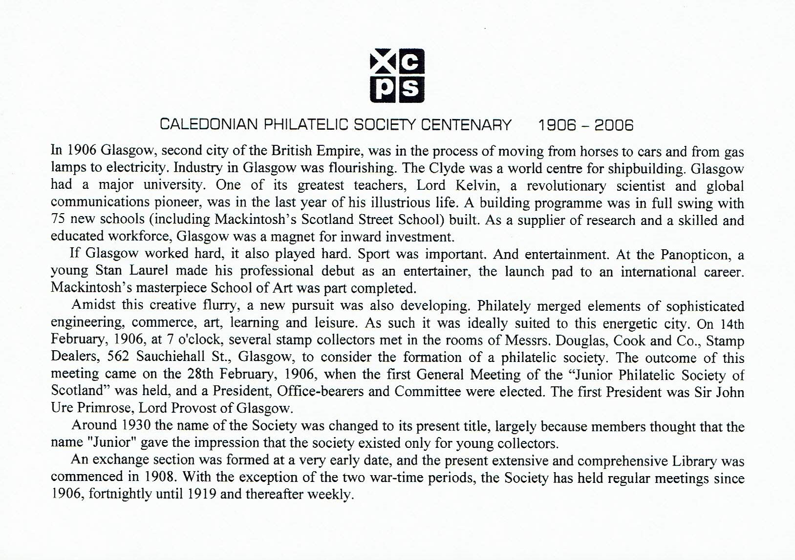

## History



### Centennial
Insert from Catalogue of Display to Royal Philatelic Society London descriding the origins of the Caledonian Philatelic Society.

Further detail is given in the bokk , entitled "The Caledonian Philatelic Society 1906 - 2006 - A Century of Scottish Philately"

