# Congress Covers

## 1972

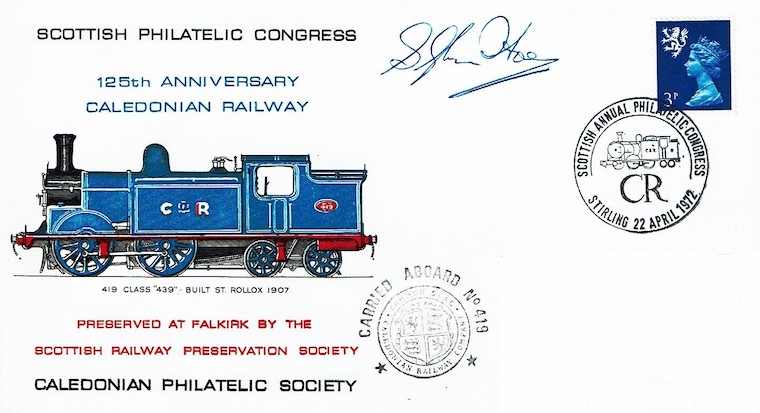

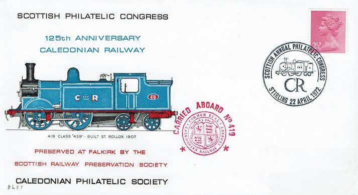

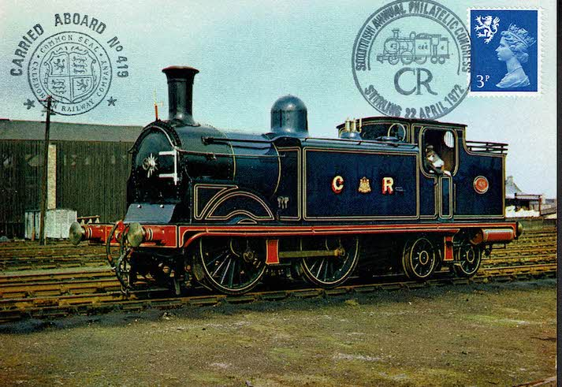

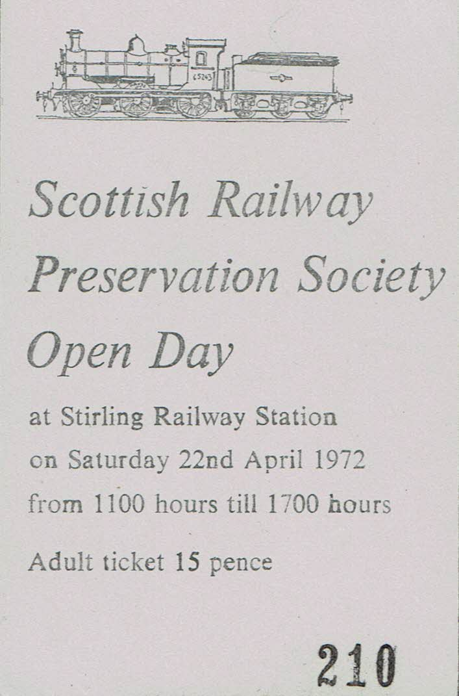

## 1981

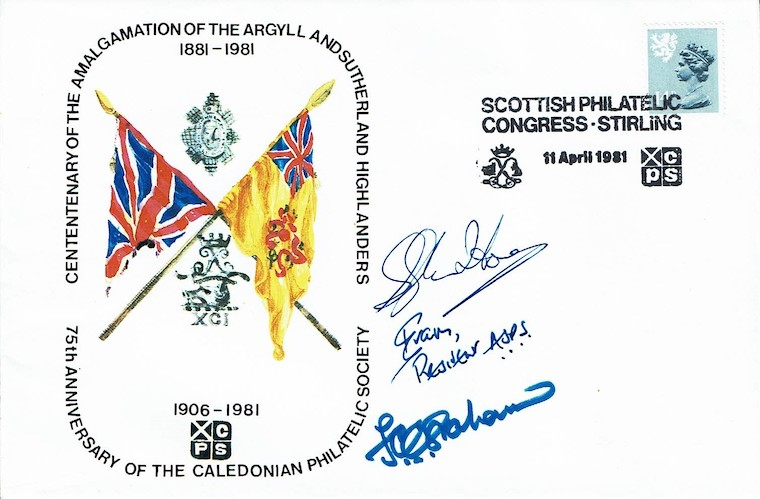

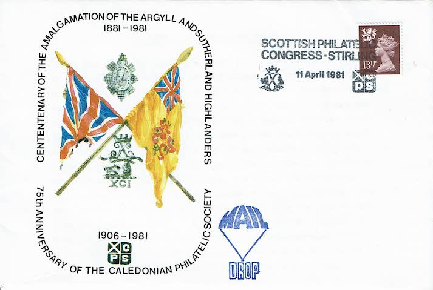

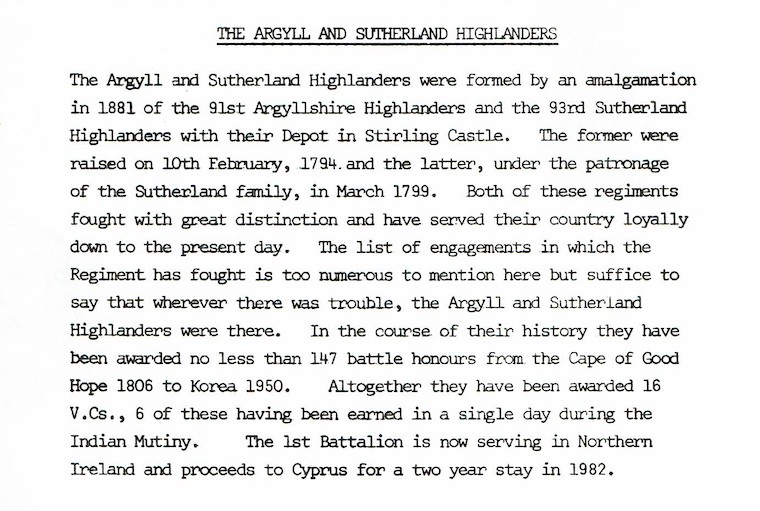

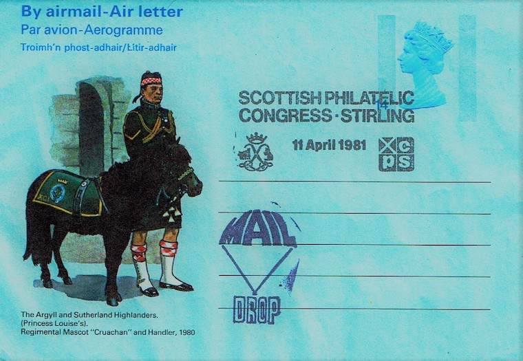

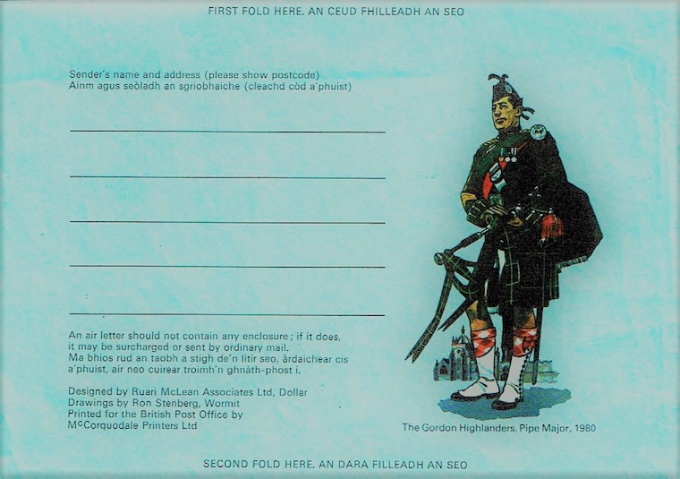

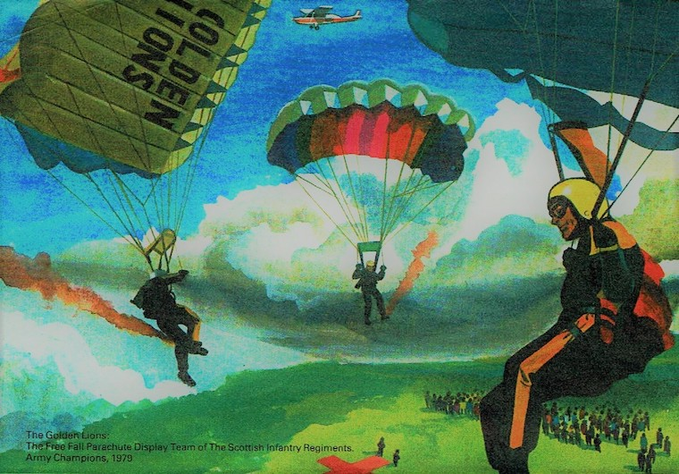

## 1996

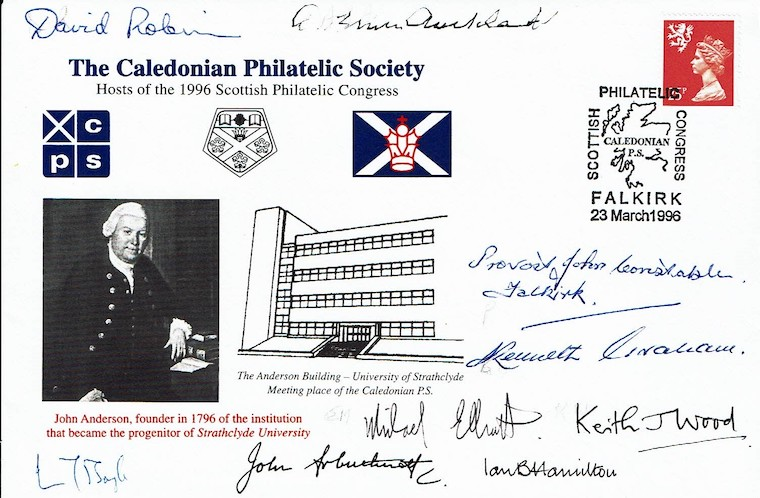

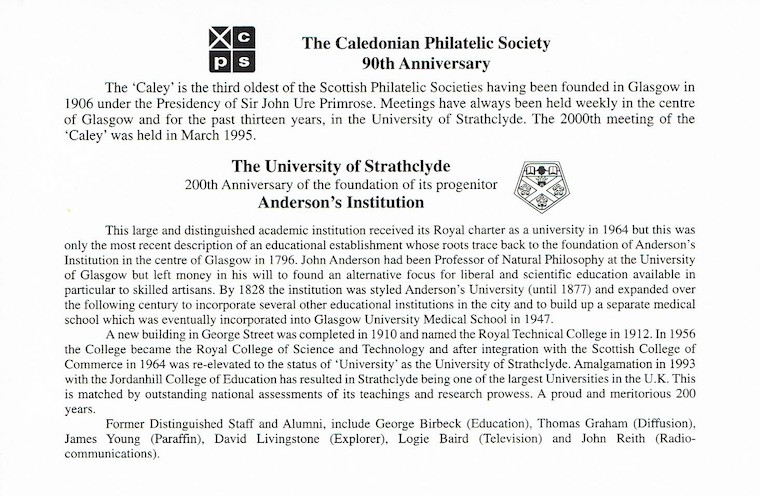

## 2016

Congress Cover

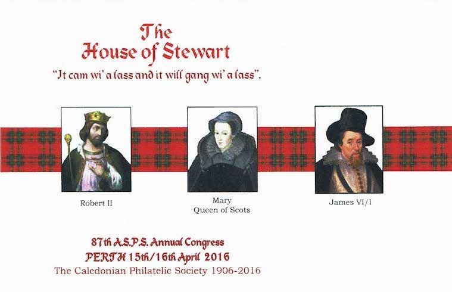

Insert with sayings from King James Authorised Bible

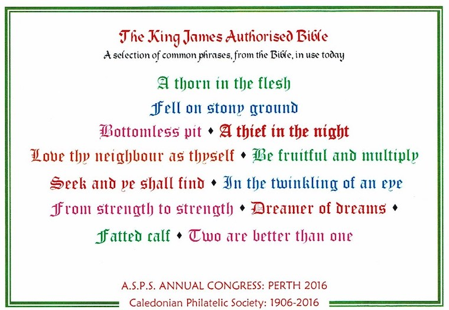

Insert with history of The House of Stewart/Stuart

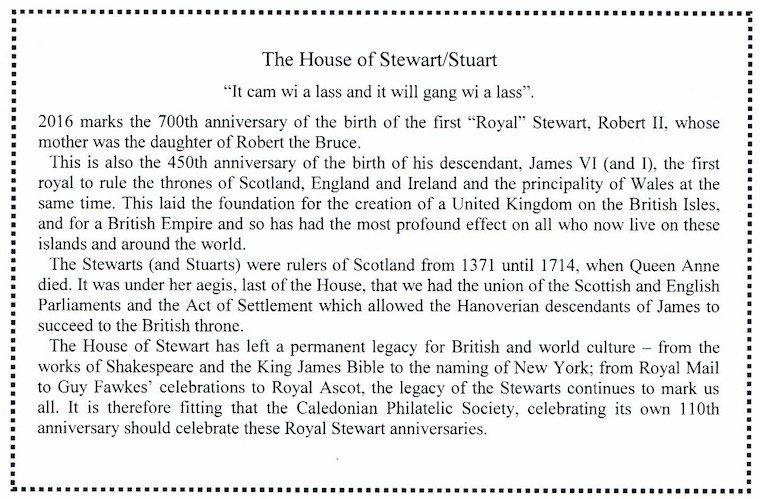
