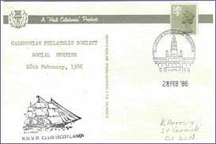
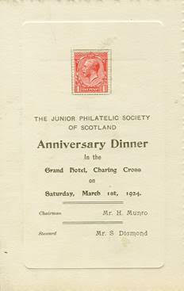

# Events

## Kelvin Hall Open Days and Chinese New Year

In recent years a set of tables has been set up at the Kelvin hall Open Day, which is normlly in early November each year. On one occasion there was also attendance at the Chinese New Year event in the Kelvin Hall. This is a good opportuity to publicise the Stamp Club and portray the joys and variety of things that can be done by collecting stamps. Normally we provide cards withe an animal, bird or fish in the centre and children are encouraged to stick stamps around the edge to make a colourful montage which they can take away. Children are also able to help make a stamp "snake". The event is very well attended and about 100 or more children have attended the stamp club tables. Parents are also encouraged to help and perhaps see the joy of stamp collecting.

## Social Evening
One of the highlights of recent years has been the Calrdonian Philatelic Society Social Evening. The first Social Evening was held in 1986 on the SV Carrick. Over the years the Social Evening was held in a variety of different venues:

1986 – 1989 SV Carrick – Moored on Clyde Street, Glasgow

1990 – 1991 Kingspark Hotel, Rutherglen

1992 – 2008 The Wickets Hotel, Glasgow

2009 – 2019 The Hilton, Grosvenor, Glasgow

2023 - The Hilton, Grosvenor, Glasgow

In recent years the annual competition prize winners were presented with their trophies.

Much needed funds for the Society were raised at the evening from a silent auction. This would be followed by a quiz ably compiled and compered by Ken Norris.

A souvenir postcard would be produced for each year – the card from the first Social Evening in 1986 is shown below.

The Social Evening was not held in 2020, 2021 or 2022 due to the restrictions imposed by the COVID-19 pandemic.Falling numbers and fears of meetings in closed spaces plus more unwillingness to travel at night has meant that the Social Evenings have ceased. THese dificulties have had a knock on effect on meeting attendances as well. With an aging demographic this problem will only persist and increase.

### 1986 Social Evening Souvenir Cover

### 1924 Anniversary Dinner

