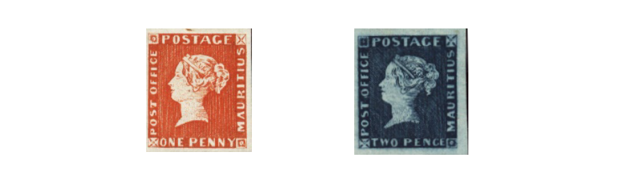

## Forgery Collection

The Forgery Collection was established in February 1924 under the stewardship of Hugh Monro, the incumbent President.  Up until then the Society made donations to the forgery collection held by the Philatelic Congress of Great Britain.  The collection has been enhanced over the years by many donations and looked after by  J R Raeburn,  Donald Chisholm, James Merrylees, R Kerr, Bert Mendelsohn, Jim Fairbairn, Graham Hoey, Garry Buchanan , Alan Wishart and now by the current forgery warden Stewart Gardiner and it is available for consultation by members on request.

A photocopy of all fully written-up pages of the collection, which are listed below, resides in the library and is available at meetings to members.  These represent about 60% of the collection. The collection will be made much more accessible soon as all the fully written up pages are being scanned and will be available on CD to members.  This will greatly enhance its value to members.
The collection is not limited to forgeries as it also includes reprints, fakes and bogus stamps.

The collection contains some very scarce material including the scarce Mauritius reprints shown below.

### Tutorials

A very useful part of the collection is a series of “tutorial” pages that provide clear examples and explanations of:

Type    | Note
------- | -------
Forgeries |	A range of genuine and forged stamps of the same type. |
Forgeries |	Some dangerous types. |
Forgeries |	Forged overprints applied to genuine stamps. |
Forgeries | 	16 Sperati reproductions: eight of France; one of Saxony; three of Spain; two of Newfoundland and one each of Great Britain and Lagos. |
Forgeries |	False postmarks. |
Forgeries |	Official imitations made from new dies or plates.  |
Reprints |	A range of examples with strength in German States. |
Reprints |	Examples of reprints with false postmarks. |
Reprints |	A range of “Seebecks”. |
Fakes |	Stamps which may be wholly or partially genuine but have been altered to be not what they seem. |
Bogus |	Fictitious stamps or overprints. |
Remainders |	Obsolete stamps sold by their respective governments which can be unused or cancelled by favour. |
Repairs |	Stamps with faults that have been covered up. |
Printing |	How to distinguish typographed and lithographed stamps. |

The collection provides guidance on how to distinguish genuine stamps from forgeries and provides many examples for comparison as shown below.

Page on “Repaired Stamps” from the tutorial section of the collection

### Great Britain and Commonwealth

Country | Notes |
--- | ---
Great | Britain	The 1/- green Stock Exchange forgery and a number of originals.  Two examples of photographic forgeries of entires with 1d black stamps.   A photographic forgery of a used Mulready envelope.  A reprint of an Uddingston pre-stamp postmark.  The miniature sheet commemorating the centenary of the 1d black and 2d blue produced by James Walker.  The forged “England Winners” overprint. |
Bahamas |	Forgery of the four pence on six pence overprint. |
British | Columbia	Forged Vancouver Island stamps. |
British | Guiana	A good range of forgeries of the 1862 Provisional, the 1860-65 and the 1860-75 issues. |
British | Honduras	Lithographed forgeries of the first issues. |
British | North Borneo	Forgeries of the first issues. |
Brunei |	The first issue originally thought to be bogus: the set in mint pairs plus one with forged postmark. |
Cape | of Good Hope	An extensive range of forgeries of the triangular issues. |
Ceylon |	Lithographed forgeries. |
Dominica |	A range of forgeries. |
Faridkot |	A range of reprints and forgeries and a bogus issue by the Post Office. |
Heligoland |	Reprints with forged postmarks. |
Hyderabad |	Reprints.  |
Gambia |	Forgeries. |
Hong | Kong	A good range of forged QV stamps some with forged surcharges. |
India |	Reprints of service stamps. |
Ionian | Islands	Lithographed forgeries. |
Mauritius |	Reprints of the “Post Office” stamps.   Sheets of forgeries of the “Post Office” and “Post Paid” issues.  Forgeries of the “Britannia” type.  Forgeries of the 1860 issue. |
Nevis |	Engraved and lithographed forgeries of the first issues. |
Newfoundland |	Engraved forgeries and a good range of lithographed forgeries. |
New | South Wales	"A good range of lithographed forgeries of the “Sydney View” issue. |
Reprints | of the second issue.  Lithographed forgeries of the 1854-56 issue." |
Nova | Scotia	"An engraved forgery and lithographed forgeries of the first issue. |
Lithographed | forgeries of the second issue." |
St | Helena	One engraved and several lithographed forgeries of the first issues. |
St | Lucia 	Lithographed forgeries of the first issue. |
St | Vincent	Lithographed forgeries of the first issue. |
Sierra | Leone	Forgeries of the first and second issues and a forgery of surcharge on the second issue. |
Sudan |	A good range of forgeries of the overprinted stamps of Egypt. |
Tasmania |	Lithographed forgeries. |
Transvaal |	Unofficial reprints with forged postmarks. |
Victoria |	Lithographed forgeries of the “half length” issue including a sheet by Jeffryes.  A re-perforated example of the 1871-73 8d. |
Virgin | islands	A good range of forgeries of the 1d and 6d “St Ursula” type and the 4d and 1/- values of the “figure of the Virgin” type. |
Western | Australia	One engraved and a good range of lithographed forgeries of the “Swan” type including forged surcharges. |

Page on the forgery of the 1/- green Great Britain “Stock Exchange”

### Foreign

Country | Notes |
--- | ---
Argentina |		"1858 issue - genuine 5c stamp plus remainders with forged postmarks. Four types of forgeries. 1862-64 issue - originals plus reprints.  Bogus 10c and 15c values. Forgeries. Complete sheet of reprints plus complete sheet of bogus 10c stamps. Reprint of 1862-64 five cent reprint on cover London postmark.  Pair of bogus 15c stamps with forged cancellation." |
Austria | 1851-56 newspaper stamps: Range of used forgeries and mint reprints.|
Azerbaijan |		Bogus stamps.	 |
Belgium | "1866 2c value - forgeries. 1878 5 franc value -dangerous forgeries in blocks. 1879 and 1882 railway stamps - genuine and forgeries. 1914 and 1918 - range of bogus red cross stamps. 1911 Charleroi overprint - genuine and forged overprints; three types. 1914 5c, 10c and 20c Red cross - genuine and two types of forgeries. 1914 5c, 10c and 20c - genuine and three types of forgeries. 1914  - cover with Red Cross stamps and postmarks, all forged." |
Bolivia |		1894 issue - originals, and reprints with forged postmarks and reprints genuinely used.	 |
Brazil |		"1843 Bulls Eyes. Photographic reproductions of originals and three types of forgeries. 1844-48 issue, originals and two types of forgeries."	 |
Bulgaria |		“Battle of Shipka Pass” issue - originals and forgeries, mint and with forged postmarks.	 |
Chile |		"1854-67 issue – originals and forgeries. 1867 issue - originals and forgeries."	 |
Costa | Rica		1881-82 surcharge on 1863 issue - original and forged surcharges.	 |
Danzig |		1920 original and forged overprints.	 |
Denmark |		1851-53 issue - forgeries.	 |
Danish West Indies |	1873-79 issue - forgeries.	 |
Dominican Republic |		1900 - original and forgeries.	 |
Egypt |		Suez Canal Company - genuine and range of forgeries.	 |
Finland |		"1845 postal envelope cut-out - original and forgery. 1850 postal envelope cut-out forgery."	 |
Formosa |		"1888 issue - forgeries. Bogus stamps."	 |
French Colonies	 |	"1892 issue - originals and forgeries - rare Panelli approval booklet. 1892  issue -originals and range of Fournier forgeries. 1892 issue - bogus overprints."	 |
French Post Offices in Crete |		1903 issue - original and dangerous forged stamps with forged surcharges and postmarks.	 |
Germany |		"1943 propaganda forgeries of 12pf Hitler head stamp: single and block of four. Cover  with block of nine 12pf Hitler head propaganda forgeries together with a single original 30pf stamp from the same issue."	 |
German Occupation of France	|	1941-42 Petain propaganda forgery.	 |
Greece |		Large Hermes Heads.  A good range of forgeries.	 |
Hamburg |		"1859-65 issue.  Good range of original and forged stamps: five types. 1864-66 issue. Originals and forgeries. 1866 rouletted issue. Original and forgeries. 1864 issue. Range of Goldner reprints: imperf. and perf. 11 ½ or 13 ½. 1864-67 issue – range of remainders cancelled with original postmark which was never legitimately used to cancel stamps."	 |
Hawaii |		"1853 issue. Forgeries, mint and “used”. 1859-62 issue - range of forgeries mint and two “used”. 1864-71 issue. Lithographed forgeries."	 |
Latvia |		1933 Latvia-Gambia flight issue. Forged overprints.	 |
Luxemburg |		"1852 issue - two “used” forgeries. 1859-63 issue - two “used” forgeries. 1875-80 issues - range of forged overprints."	 |
Mexico |		1856-61 issue. Two originals and range of lithographed forgeries - eleven types. Also two bogus stamps.	 |
Norway |		Article on the Grieg “Phantoms”.	 |
Parma |		1859 issue- photographic reproduction of an original and several forgeries.	 |
Russia |		1918 - bogus stamps.	 |
Serbia |		1904 issue (the “death’s head” issue) originals and forgeries.	 |
Shanghai |		1865 issue - Fournier forgeries in a block of eight (6 candareens) and a sheet of 16 (12 candareens).	 |
Sicily |		Originals and lithographic forgeries - five types.	 |
Spain |		"1852 and 1853 issues forgeries. 1866 issue. Range of forgeries. 1873 and 1874 issue forgeries."	 |
Switzerland |		"Basle: 1845 Basle Dove - original and forgeries. Geneva : 1843 issue- photographic reproduction of original and forgeries, one with forged postmark. Zurich :  1843 issue - original and forgeries of 4 and 6 values."	 |
Turkey |		"First issues - range of forgeries. Liannos first local - forgeries. Duloz type - originals and forgeries. Duloz type - unofficial bisects - originals and forgeries. 1914 overprints - originals and forgeries. 1916 overprints - originals and forgeries and bogus."	 |
Turkistan |		1918 – bogus surcharges on original stamps.	 |
Tuscany |		"First issue - lithographed forgeries. Third issue - forgeries."	 |
USA |		"5c Post Office – forged pair on piece. Newspaper stamps -good range of forgeries some overprinted “Facsimile”."	 |
Upper Silesia |		1920 forged CIHS overprint.	 |
Uruguay |		"1858 issue reproductions of originals and range of forgeries - four types. 1859-62 issue.  Originals and good range of forgeries - six types."	 |
White Russia |		1918 unissued originals and forgeries.	 |