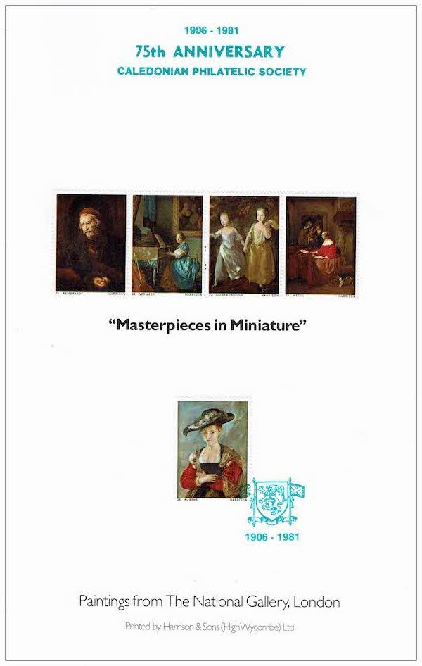
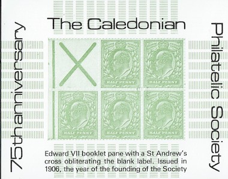

# History

1. [Centennial](#centennial)
1. [Hosting ASPS Annual Congress](#hosting-asps-annual-congress)
1. [2500th Meeting](#2500th-meeting)
1. [110th Anniversary](#110th-anniversary)
1. [Philatelic Congress of Great Britain](#philatelic-congress-of-great-britain)
1. [Royal Philatelic Society of Great Britain Visit 2006](#royal-philatelic-society-of-great-britain-visit-2006)
1. [75th Anniversary](#75th-anniversary)

One of the UK's longest-running philatelic societies, Caledonian Philatelic Society was founded on 14 February 1906 when a group of stamp collectors met on the premises of Douglas, Cook & Co Stamp Dealers on Sauchiehall Street, Glasgow, and made the decision to form a philatelic society. The group was initially known as the Junior Philatelic Society of Scotland, changing to its current name in 1930. Its first president was Sir John Ure Primrose, Glasgow's Lord Provost, and he continued as president until his death in 1923. On its 75th anniversary, the Society hosted the annual Congress of Scottish Philatelic Societies at Stirling University. One souvenir produced to mark the anniversary was a miniature sheet depicting a booklet pane with a St Andrews cross which was first printed in 1906, the year that the Society was formed. In its centenary year, the Society hosted the ASPS Congress at Perth; organised the Philatelic Congress of GB in Renfrew in July and gave an invited display to the Royal Philatelic Society London in November 2006. Two special evenings were included in the Syllabus when Past Presidents gave short displays to the members. The society has met at several Glasgow venues over the decades and currently meets weekly from early October to the middle of December and from early January to mid-March on the fifth floor of the Graham Hills Building, University of Strathclyde, George Street. The two thousand-five hundredth meeting of the Society was held on 13 October 2016.

## Centennial
The text below was printed on the insert for the 2006 ASPS Congress Cover, which the Caledonian Philatelic Society hosted in its Centennial year.

Further detail is given in the book, entitled "The Caledonian Philatelic Society 1906 - 2006 - A Century of Scottish Philately" which is given in more detail in the [Publications page](./publications).

During the year the Society also organised the Philatelic Congress of GB in Renfrew in July and gave an invited display to the Royal Philatelic Society London in November 2006. Two special evenings were included in the Syllabus when Past Presidents gave short displays to the members.

### Caledonian Philatelic Society Centenary 1906 — 2006 Glasgow

City of leisure and learning, optimism, wealth, power, spirit and warmth.

In 1906 Glasgow, second city of the British Empire, was in the process of moving from horses to cars and from gas lamps to electricity. Industry in Glasgow was flourishing. The Clyde was a world centre for shipbuilding. Glasgow had a major university. One of its greatest teachers, Lord Kelvin, a revolutionary scientist and global communications pioneer, was in the last year of his illustrious life. A building programme was in full swing with 75 new schools (including Mackintosh's Scotland Street School) built. As a supplier of research and a skilled and educated workforce, Glasgow was a magnet for inward investment.

If Glasgow worked hard, it also played hard. Sport was important. And entertainment. At the Panopticon, a young Stan Laurel made his professional debut as an entertainer, the launch pad to an international career. Mackintosh's masterpiece School of Art was part completed. In that year too, Mackintosh and his wife moved into 6 Florentine Terrace, Glasgow, a house now recreated in Glasgow University's Hunterian Art Gallery.

Amidst this creative flurry, a new pursuit was also developing. Philately merged elements of sophisticated engineering, commerce, art, learning and leisure. As such it was ideally suited to this energetic city. In February 1906 a group gathered to form the Junior Philatelic Society - 100 years later that Society, now called the Caledonian Philatelic Society, is still going strong and is happy to host the 77th Congress of the Association of Scottish Philatelic Societies.

In the century which followed, Glasgow has been transformed. The city suffered decline when its shipbuilding, mining and heavy manufacturing industries lost their competitive edge in the post-war years. Glasgow, however, did not accept that decline was its fate and began to transform its economy to one based on knowledge, services, culture and tourism.

Glasgow has become a natural focal point for knowledge based industries. The city continues to develop innovative ways of using new technologies to drive economic growth for the benefit of its citizens and the Scottish economy. As part of its reinvention, the city has won many accolades: UK Garden Festival City 1988; European City of Culture 1990; British City of Architecture 1999; and most recently it was recognised as the world's 'Intelligent Community of the Year; 2004-5'.

The City has been well recognised by philately. Stamps featuring Glasgow, Glasgow events, Glasgow products and Glaswegians (including adopted ones) abound, issued by postal administrations around the world from St Lucia to Tuvalu. 2006 also marks 50 years of Europa stamps which have commemorated increasing cooperation amongst European states.

In the 21st Century, the Caledonian Philatelic Society also continues to flourish. It meets on Thursdays from October till April in Strathclyde University. Members are recognised for their knowledge and expertise throughout the philatelic world and new members are always made most welcome. We take pride in always showing a welcoming face and can guarantee anyone joining us a very fine evening, and never a fine mess.

[back to top](#history)

## Hosting ASPS Annual Congress

The Association of Scottish Philatelic Societies (ASPS) is the association bringing together all the Philatelic Societies in Scotland. Each year a Congress is held in April and one of the member societies undertakes hosting, Usually the choice of year to host the congress ties in with some significant event related to that society. The Caledonian Philatelic Society hosted Congress, in recent years, in 1972, 1981, 1996 and 2016 on significant Society anniversaries. For each Congress, to raise funds, it is normal for Societies to produce special covers and the covers for the years above are shown below. There are also inserts which provide information and background to the anniversary, often tieing in to other significant anniversaries.

The covers produced, along with the inserts, are shown on the [Congress Covers page](./congress-covers).

[back to top](#history)

## 2500th Meeting

Content still to come.

[back to top](#history)

## 110th Anniversary
2016 marked the 110th Anniversary of the founding of the Caledonian Philatelic Society in 1906. The Society hosted the Association of Scottish Philatelic Societies at the Dewar's Centre in Perth on April 15 and 16, 2016. Many different activities took place over the year as part of these Celebrations.

As is traditional many members exhibited samples of the wide collecting interests at the Host Society display. There was an opportunity to purchase souvenir covers and cards of events which shared the anniversary. King Robert II of Scotland was born in Paisley in 1316 while King James VI of Scotland and I of England was born in Edinburgh in 1566. Therefore their 700th and 450th Anniversaries occur in 2016. A cover showing images of Robert, Mary Queen of Scots and James VI/I was available for purchase and serviced covers were available after the Congress. A postcard celebrating the contribution of the King James Bible to the English language with a number of well-known sayings on the image side was also produced.

Dr Stewart Gardiner compiled a book entitled "Philatelic Witnesses to the Great War" (further detail is presented on the [Publications page](./publications)). This book reflected the fact that philatelists are responsible for accumulating items which throw light on aspects of the war which might otherwise be lost. Postcards and letters as well as patriotic labels are some examples of the material which is involved. Some of this material was exhibited at the Goethe Institute in Park Circus Glasgow during November and December 2015.

Joan Trew also produced a specially commissioned display which charted some of the events which happened during the latter part of the dynasty and events such as the Gunpowder Plot were illustrated by stamps and covers.

[back to top](#history)

## Philatelic Congress of Great Britain

Amongst other events and activities ABPS (Association of British Philatelic Socieies) organises the annual Philatelic Congress of Great Britain. This is held on an annual basis at a different venue each year. Congress is the opportunity to meet with fellow collectors and events include discussions, displays and visits, plus the ever-enjoyable Congress Banquet. In 2006 to coincide with the Centenary of the Society, ABPS Congress was hosted by Caledonian Philatelic Society in the Normandy Hotel in Renfrew.

The highlight for many is the occasion at which the Congress Medal is presented. recognising those who have achieved international recognition for their outstanding studies and research in the philatelic sphere, demonstrated through their own collections

Left to right - Elizabeth Nairn, Alan Wishart, Margaret Morris (Immediate Past President) and Ian Hamilton (President).  Pictured on their recent visit to Derby as part of the preparations for the Philatelic Congress of Great Britain in 2006.

This year's Congress, held in Renfrew in July was organized by the Caledonian Philatelic Society as part of our Centenary Celebrations. Apart from the organizing committee, some of our other members featured in the event. One of the opening displays was given by our member Bill Spalding and was devoted to "Laurel and Hardy". The ASPS Congress cover was used with a special handstamp at PCGB.

The Congress Medal for 2006 was awarded to our Secretary Ken Norris for his service to philately in Scotland.

Ken on the right with Margaret Morris, his sponsor and Professor John West, Chairman of ABPS.

This photo appeared in the "ABPS News" issue September 2006.

And last but not least Julia Macleod won a Penny Black at the Reception hosted by Bonhams at the Congress.

Graham Childs  with his wife Penny (right) hosted the reception are pictured with Julia (middle left) and Helen Walker the other winner of a Penny Black.

This photo appeared in the "ABPS News" issue September 2006.

The report of the meeting on the Renfrewshire Council's website has been deleted

[back to top](#history)

## Royal Philatelic Society of Great Britain Visit 2006

The Royal Philatelic Society London is the oldest philatelic Society in the world, established in 1869 as The Philatelic Society, London. It is regarde as one of the premier philatelic societies in the world. Some of our members have been elected as Fellows of the RPSL (FRPSL) - a prestigious honour. It is an honour to be invited to present displays at RPSL and the Caledonian Philatelic Society was duly invited in 2006 in their Centenary year.

The Society wishes to thank the following members who have contributed selections from their collections for this display.

Raymond Baldock, Alan Blakeley, Colin Breddy, Bill Colley, Michael Cooke, James Cunningham, Iain Dyce, Ian Evans, Stewart Gardiner, Bob Gray, Ian Hamilton, Graham Hoey, Jack Kilpatrick, Willie King, Sandy MacCalman, Paul McGowan, Dave Matthews, Chris Moffat, Margaret Morris, Jim Moir, Elizabeth Nairn, Bill Neithercut, Ken Norris, Gordon Shepherd, Ian Smith, Joan Trew, Alan Wishart, Russell Walker, Derek Wiltshire, Terry Woods, David Woolley.

The following image shows the cover of the catalogue of the display given to RPSL.

Members of the Caledonian Philatelic Society submitted a number of frames on a very diverse range of topics for display at the RPSL. The frames and topics are listed below.

### Fr. 1-3   The Caledonian Philatelic Society

Some pages from the Caledonian Philatelic Society's archives illustrating its birth as the Junior Philatelic Society of Scotland and its early Philatelic activities.

### Fr. 4-6 Caledonian PS Forgery collection

A selection of some of the varied material contained in the Society's Forgery Collection.

### Fr. 7-8 "I belonged to Glasgow"

Glaswegians on stamps, covers, booklets and other philatelic material. A display specially commissioned for the Centenary of the Caledonian Philatelic Society in 2006.

### Fr. 9-10 The Clyde - Shipbuilder to the Wor

The following sheets seek to give a brief history of the River Clyde and through the medium of stamps illustrate the variety of ships built in the many shipyards along its banks.

### Fr. 11 Millport - The Greater Cumbrae

A selection of handstamps from this popular Clyde island - covering the period 1853 to 1966.

### Fr. 12 The life and times of Para Handy

Postcards were at their highest popularity when in 1906 Neil Munro published his short stories relating the escapades of Para Handy and the crew of the Vital Spark as they sailed ^around the Clyde and the West of Scotland. Here postcards are used, not too seriously, to illustrate the topical events that Munro often featured in his tales.

### Fr. 13-14 Campbeltown - Postal markings to 1840

A Registered Port with its own fishing fleet, it was the second Post Office in the County of Argyll and was opened by 1755. (The first was at Inveraray by 1715.) A Royal Charter dated 19th April 1700 was granted by King William III, raising the old Burgh and Barony to the "Dignities and Privileges of a Royal Burgh".

### Fr. 15-16 Numbered postmarks of Lanarkshire

This exhibit shows examples of the barred 1844 type, the duplex and circular postmarks. Some struck in blue, postal rates,
instructional postmarks, unusual frankings and the rare Hamilton single arc duplex are shown.

### Fr. 17-18 Postmarks of the Caledonian Railway

A collection of postmarks starting from the early undated ones of 1851 (red for day, black for night) to more modem ones used as late as 1982.

### Fr. 19-20 The Mystery of the "IRELAND" Handstamps

The exhibit shows two aspects of this fascinating subject. Frame 1 - examples of the 40mm and 45mm IRELAND
handstamps in pale claret and black, struck in Ireland. Frame 2 - examples of the 38mm and 66mm S/IRELAND handstamps used in London on letters arriving on a Sunday.

### Fr. 21 Bo'ness handstamps

The post office opened in 1725 with the town becoming a Burgh of Barony in 1748. This short display shows the development of its handstamps from the Straight Line namestamps to the numbered Double Circles.

### Fr. 22 Scottish Airmals

On 8th May 1933 Highland Airways inaugurated a passenger service between Inverness and Kirkwall. In 1934 the PMG placed a contract for the conveyance of all first class mail by Highland Airways. This service commenced on 29th May 1934.

### Fr. Greece

Early Airmails A selection of covers to illustrate the early designs of air- mail stamps. Evidence for developing routes e.g. Athens-Cape Town etc.

### Fr. 24 Saharan Airmails

A collection of postal history items which have crossed all or part of the Sahara Desert by air.

### Fr. 25 Royal Navy Battleship Cachets

For decades battleships had been the prime ships of the Royal Navy. These sheets recall famous names - 'Warspite', 'Hood', 'Rodney' and 'Vanguard' with covers, cards and cachets.

### Fr. 26 Effects of War on Postage Stamps

Stamps can be altered by war in a number of ways - local stamps overprinted by the occupying power; stamps of the occupying power
overprinted etc., etc. The subject of this display is War Relief, Red Cross and War Tax surcharged stamps.

### Fr. 27-28 Uganda Internment Camps WW II

The exhibit shows examples of mail relating to the internment camps in Uganda with particular emphasis on the Maltese removed
from Malta under the emergency Powers Act.

### Fr. 29 Malawi 1964-1966 first two years of Independence

Malawi was granted independence on 6th July 1964 and celebrated the event with an Independence Trade fair from 4-6 July. An unusual air letter was produced canceling a Nyasaland stamp with a Malawi canceltwo days before Independence and Lilongwe P. S. landed in hot water by using the sacrosanct cockerel emblem for an FDC. Numerous varieties were produced before Malawi was given Republic status in 1966.

### Fr. Crimea: Covers and Cards

The war against Russia, more commonly known today as The Crimean War, started in October 1853 when the Turks declared war on the Russians who had occupied Moldavia and Wallachia - still part of the Ottoman Empire at the time. The Turks had an alliance with France and France with Britain and they joined in during March 1854, the war lasted until 1856.

### Fr. 31-32 Philatelic History

Extracts from a collection of letters to and from notable figures in the world of Philately: illustrating the history of our hobby.

### Fr. 33-34 Saudi Arabia

This exhibit shows the Sir R. Storrs' copy of the Survey of Egypt book, his cover to Sir Mark Sykes (of the Sykes/Picot treaty). A proof with (Lawrence's?) notes  and how Sherif Hussain's 'unadopted' design eventually was adopted.

### Fr. 35-36 Imperial Russia

A study of the stamps and postal history showing the various printings of the 1914 and 1915 War Charity issues produced for the benefit of the widows' and orphans' fund organised by the Imperial Women's Patriotic Fund.

### Fr. 37-38 Straits Settlements The Indian Administration mail to 1867

The British settlements along the east coast of the Straits of Malacca were acquired around the beginning of the nineteenth century and amalgamated into the Strait Settlements in 1826. The display traces the early markings and the use of India stamps in Penang and Singapore up to the time of transfer to the Colonial Office in 1867.

### Fr. 39 King Edward VII 1 ½d

This short display of the King Edward VII 1 ½d  postage stamp attempts to convey the fascination and frustration inherent in the complexities in this issue.

### Fr. 40 Early St Pierre et Miquelon

The islands of St Pierre and Miquelon, now part of France, have enjoyed an interesting history in terms of sovereignty and of trade. This
interesting history also applies to the early stamp issuing policy of the islands. The exhibit provides some examples of this for the period up to 1909.

### Fr. 41  The Development of Bahamas Postal Stationery

The sheets show some of the stages in the design and preparation, by De La Rue, of the Postal Stationery for Bahamas
during the reign of Queen Victoria, from the original Artist's drawings to the issued envelopes and cards.

### Fr. 42  The Jersey Pictorial Issue 1943-44

With the occupation of the Channel Islands by German forces various 'local' stamps were produced to meet postal requirements as British stamps were no longer available. Following on from the earlier "Arms' issue, the famous Jersey artist Edward Blampied was commissioned by the authorities to design a set of six stamps, depicting local scenes. This display of these 'Pictorials' includes proofs, gutter pairs, varieties and a selection of covers and cards.

### Fr. 43-44 Netherlands Mail censored during the Boer War an### 1

The Netherlands was a non-belligerent nation in both these conflicts of the first two decades of the 20th century. However both incoming and outgoing mails suffered censorship by various authorities. This brief display shows examples of some of the marks and labels used in a variety of situations.

### Fr. 45 Netherlands booklets

The First automatic machine stamp booklets of Swedish design were introduced in The Hague on September 4th, 1964. The machine accepted 1 guilder coins and dispensed stamps most of which prepay the basic inland rate. The rates were increasing at this time.

### Fr. 46 Zanzibar Independence and Revolution

Zanzibar a British Protectorate since 1890, gained its Independence on 19th December 1963. On the 12th January 1964 life on Zanzibar was altered by a revolution which eventually led to the loss of its Independence. The display tries to show this using the stamps of Zanzibar.

### Fr. 47 A Century of Rotary

Rotary International celebrated its 100th anniversary in 2005, an event commemorated philatelicly by many nations. This display charts the expansion of the Rotary movement from its modest beginnings in Chicago to the world wide organisation it is today.

### Fr. 48 E=mc2

A topic of conversation amongst the members of the newly formed Caledonian Philatelic Society must surely have been the theories published by Albert Einstein the previous year (1905). This short display looks at aspects of his life and work.

### Fr. 49-50 Golf

A selection of philatelic items illustrating the Royal and Ancient game.

### Fr. 51 Postcard Exchange Collectors

A selection of postcards illustrating the conventions used and problems encountered by the members of the many postcard exchange societies which were established in the early 20th century.

### Fr. 52 Philatelic Congress of GB

The Philatelic Congress of Great Britain has been hosted by Philatelic Societies throughout Britain in many different venues. This display shows special postmarks and labels from the earlier events.

[back to top](#history)

## 75th Anniversary

1906, the year of formation of the Caledonian Philatelic Society, saw the appearance of the so-called "St Andrew's Cross" in a 2/- King Edward VII booklet of stamps. A souvenir miniature sheet produced tp commemorate the 75th Anniversary of the Society, depicts a reproduction of a pane of stamps from the booklet as shown below. The miniature sheet exists in two shades – yellow-green and blue-green.

A commemorative booklet was also produced, containing a sheet of "Masterpieces in Miniature" depicting paintings in the National Gallery. The booklet was given to members of the Society on its 75th Anniversary. The booklet was printed by Harrison & Sons Ltd. A sheet of 20 "labels" was affixed to the inside of the booklet. Four "labels" were affixed to the front cover with a fifth "label" tied with a commemorative cancellation.

### 75th Anniversary Folder

    

        <h3>Emerald Green</h3>
        
    

    

        <h3>Yellow Green</h3>
        
    

[back to top](#history)
