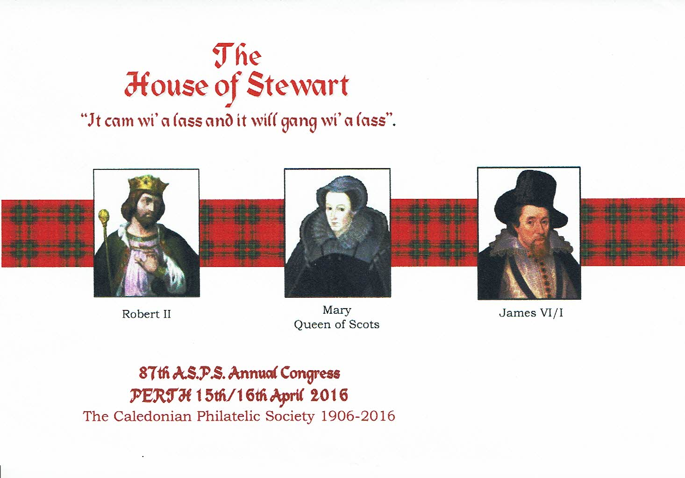
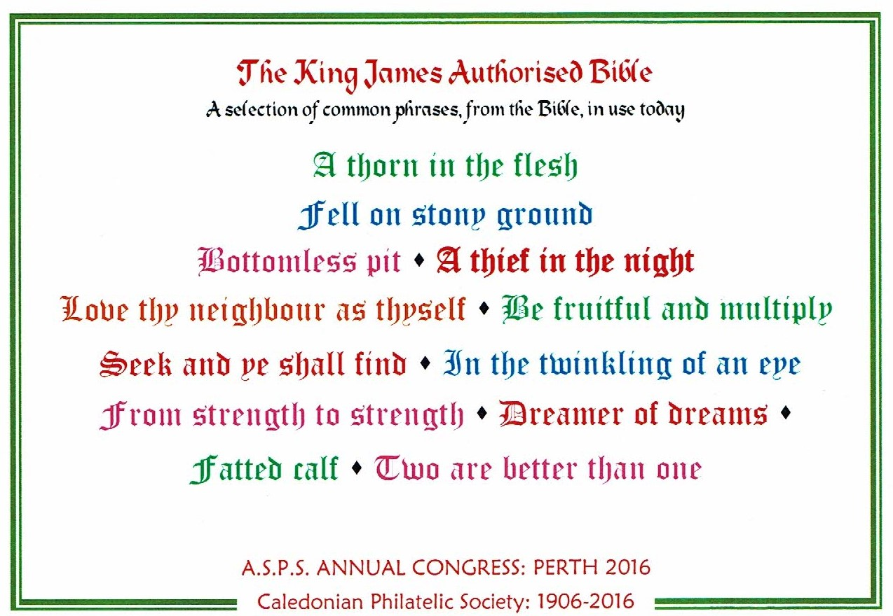
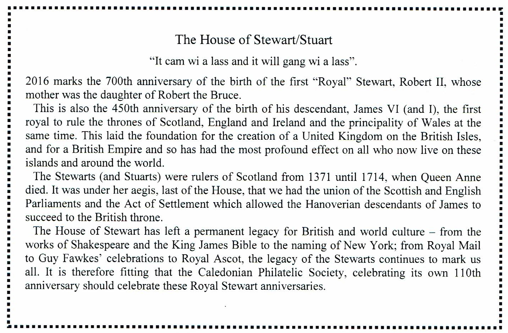

## History



### Hosting ASPS Annual Congress
2016 marked the 110th Anniversary of the founding of the Caledonian Philatelic Society in 1906. The Society hosted the Association of Scottish Philatelic Societies at the Dewar’s Centre in Perth on April 15 and 16, 2016. Many different activities took place over the year as part of these Celebrations.
As is traditional many member exhibited samples of the wide collecting interests at the Host Society display. There was an opportunity to purchase souvenir covers and cards of events which shared the anniversary. King Robert II of Scotland was born in Paisley in 1316 while King James VI of Scotland and I of England was born in Edinburgh in 1566. Therefore their 700th and 450th Anniversaries occurred in 2016. A cover showing images of Robert, Mary Queen of Scots and James VI/I was available for purchase at 50 pence before Congress and 60 pence after the event and serviced covers were available after the Congress at £2.50 each which included the special handstamp and postage and packing. A postcard celebrating the contribution of the King James Bible to the English language with a number of well known sayings on the image side was also on sale at the same prices. The cover produced is shown below, along with the two inserts.

**
Congress Cover
**

**
Insert with sayings from King James Authorised Bible
**

**
Insert with history of The House of Stewart/Stuart
**
