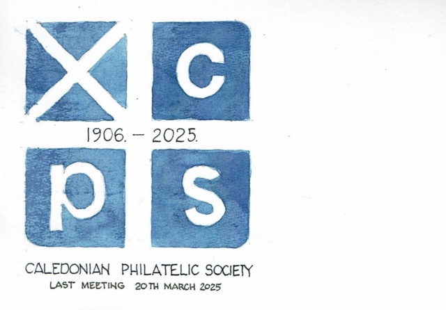
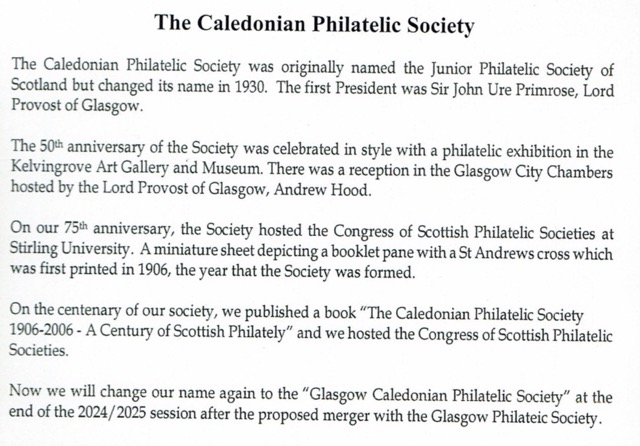

# Welcome

Welcome to the **Glasgow Caledonian Philatelic Society** promoting stamp collecting and philately in the Glasgow area since 1906.

At the 2025 AGMs of both Glasgow and Caledonian Philatelic Societies the merger to form **Glasgow Caledonian Phiatelic Society** was unanimously agreed. 

The first meeting, on 10th April 2025, of the new society, held immediately after the Caledonian PS AGM, was used to elect the Office Beaers and Committee of the new Society and they are shown in the Committee page.

## ASPS Congress 2025

The ASPS Congress for 2025 was held in the **VINE CONFERENCE CENTRE, 131 GARVOCK HILL, DUNFERMLINE, KY11 4JU** on **4th and 5th April 2025**. 

It was generally agreed that the venue was a success and the venue has been booked for 2026. Congratulations are due to the following members of the  Glasgow Caledonian Philatelic Society who won trophies in the National Exhibition.

**Traditional Non-GB Post- 1900** and **Bridge of Allan Trophy**

Dr David Stalker for ***The 1960 Christmas Stamp of New Zealand*** - Gold Medal 

**Aerophilatelic Class** and **Aerophilatelic Shield**

Dr Brian Dow for ***Norwegian Airmail & Priority Labels 1926 - 2019*** - Small Silver Gilt Medal

**Scottish Postal History** and **Bruce Auckland Centennial Quaich**.

Dr Brian Dow for P***erthshire Local Undated Handstamps*** - Small Silver Gilt Medal

**Traditional Non-GB Pre-1900 ** and **Ferris Trophy** 

Dr Stewart Gardiner for ***French "Connaissements" - "Bills of Lading" Revenues and their usage*** - Silver Medal

**Picture Postcards** and ** Scottish Postcard Trophy**

Alexander Kerr for ***Criagendoran*** - Large silver Gilt Medal

**Literature Class** and **Robson Lowe Salver**

Dr Brian Dow and Robert Watt for ***Ayrshire Post Offices and Postmarks 1661 - 2023: Part II Postmarks*** - Gold medal

**Best First Time Entrant** and **Cowell Salver**

Alistair Burrow for ***The "Invention" of Leisure Camping holidays*** - Silver Medal.

## 2025 - 2026 Session

It was agreed in the merger that 2 of the meetings each month would be in the afternoon and they would be held in **Partick Burgh Halls** on **Thursdays** as detailed below. Meetings on alternate Thursdays wil still be held in Strathclyde University as detailed below. Members enjoy talks, displays on different themes, visits from other philatelic societies and invited guests, an annual competition and the ever popular auction - the Meetings page will be updated when details of the syllabus have been finalised.

## Access to meeting room at Strathclyde University

As in previous years, evening meetings are held in the Graham Hills Building, Room GH542 at 7.30pm. Access is from Richmond Street and George Street - see the Location Page for directions. Due to changes in Strathclyde University control of access to buildings the door from George Street will be closed at 7pm and the door from the car park is via a key card. The door on Richmond Street opposite the Students' Union will always be open. To access the meeting room take the lift to floor 5. On leaving the lift turn immediately to the left and take the corridor across the top of the car park. At the end turn left and follow the corridor to room GH542. 

## Access to Joint and Afternoon meetings at Partick Burgh Hall

Location of Joint Meetings and afternoon meetings is **Room 1, Partick Burgh Hall, 9 Burgh Hall St, Partick G11 5LW**. Room is to left as you enter through Main Entrance. Doors open from 1.15pm, meeting 1.30-3.00pm

Note that car parking is limited. and is metered. There is easy access from both Partick Underground Staion and the Partick Main Line Station - with only a short walking distance to the hall. There are also a number of frequent busses along Dumbarton Road from Glasgow City Centre.

Card below, designed by Andrew Black, the current President of the Caledonoan Philatelic Society (CPS), will be given out to those members attending the CPS AGM. It provides some historical background on the CPS. The final full meeting - meeting number 2708 - will be held on Thursday 20th March 2025. The Society was originally called the **Junior Philatelic Society of Scotland**  but changed name to the **Caledonian Philatelic Society** in 1930. Now, after a further 95 years, we will be changing name again.

Full details and other detail of events and news about the hobby of stamp collecting in Scotland can be found on the [ASPS Web Site](https://www.scottishphilately.co.uk).

## Membership

The current annual subscription is &pound;15 (an out of town subscription is also available).

How to pay your subscripion

(1) By online transfer in sterling to the Society’s account:

Account name: THe Caledonian Philatelic Society

Sort Code: 82-48-08

Account number: 30558446

The sender is responsible for any bank charges involved.

Please quote your iniitial and surname as reference so we can idenify payments.

(2) By cheque in sterling sent to the treasurer. 

A. G. Blakeley

7 Albany Drive

Rutherglen

Glasgow

G733QN

(3) If none of the above is suitable, please contact the Secretary for advice.

## Visitors

Visitors will receive a warm welcome, however regular visitors are encouraged to join the Societ.

Membership benefits include access to the Caledonian Philatelic Society exchange packet circuit, impartial philatelic advice should you or your family wish to dispose of a collection and a personal email account @caledonianphilatelic.org.uk, subject to availability. Contact the webmaster with your proposed email name if you wish to take up this offer.

## Uddingston Stamp & Postcard Group

If you cannot attend in an evening or if you are at a loose end on the 2nd Monday of every month, then this daytime club is the place to be. Sponsored by the Caledonian Philatelic Society the meetings take place in the Park Church Hall, Main Street, Uddingston from 10am-12 noon. For more details and to find out more click this link.
