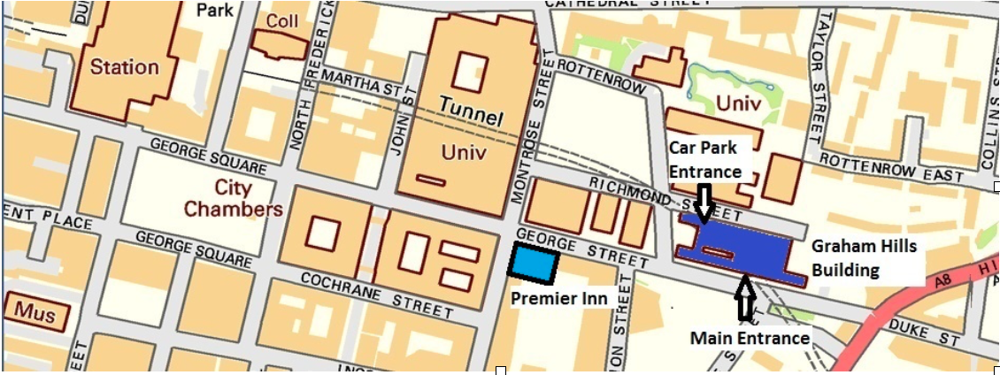
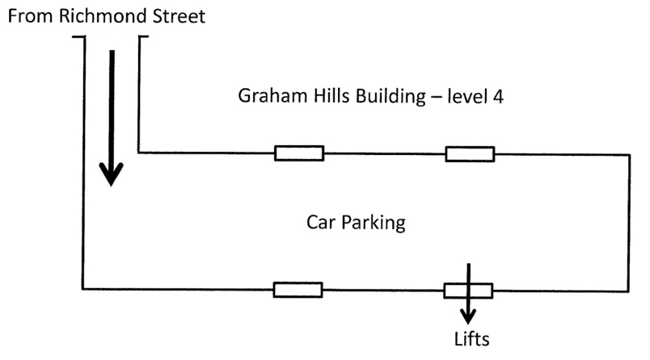

# Location

Our meeting place is in Room GH542 in the Graham Hills Building in Strathclyde University. This building is located close to the City Centre at 50, George Street, Glasgow, G1 1QE.

If you are coming by car then there is a covered Car park within the Building. Entrance to the Car Park is from Richmond Street. The barrier to the level 4 Car Park is raised at 19.00 to allow members and visitors to access this Car Park.

After parking your car use the door on the south side, furthest from the vehicle entrance, to enter the building, as shown above. You will find lifts just inside the door. Take a lift to level 5 and on exiting the lift turn right from the lobby, through the swing doors and GH542 is right across the corridor. It is very likely that you find members in the Car Park who will be able to assist if necessary.

If you are coming on foot then the main entrance to the building on George Street is open at 19.00. To reach our meeting room: turn left after entering through the main doors, go through a set of wooden swing doors, up a few steps to a lobby where there are four lifts. Take a lift to level 5 and on exiting the lift turn right from the lobby, through the swing doors and GH542 is right across the corridor.