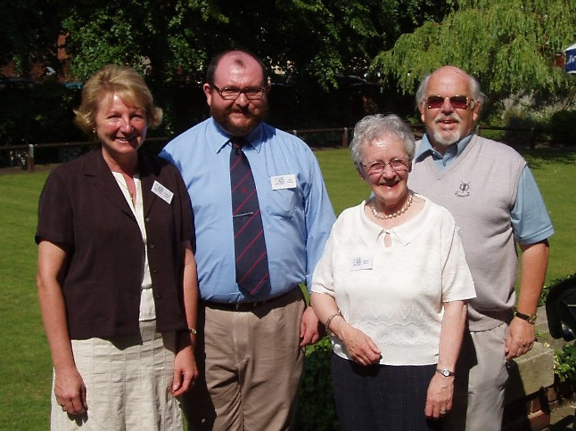
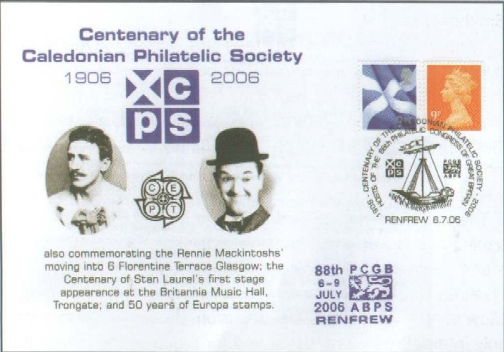
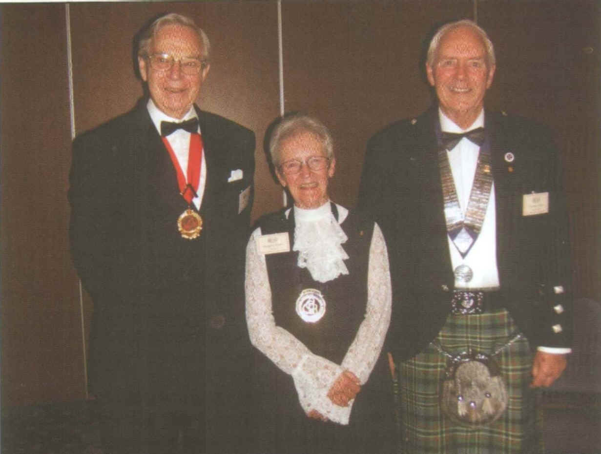

# History

[back to History](./history)

## Philatelic Congress of Great Britain

Left to right - Elizabeth Nairn, Alan Wishart, Margaret Morris (Immediate Past President) and Ian Hamilton (President).  Pictured on their recent visit to Derby as part of the preparations for the Philatelic Congress of Great Britain in 2006.

This year's Congress, held in Renfrew in July was organized by the Caledonian Philatelic Society as part of our Centenary Celebrations. Apart from the organizing committee, some of our other members featured in the event. One of the opening displays was given by our member Bill Spalding and was devoted to "Laurel and Hardy". The ASPS Congress cover was used with a special handstamp at PCGB.

The Congress Medal for 2006 was awarded to our Secretary Ken Norris for his service to philately in Scotland.

Ken on the right with Margaret Morris, his sponsor and Professor John West, Chairman of ABPS.

This photo appeared in the "ABPS News" issue September 2006.

And last but not least Julia Macleod won a Penny Black at the Reception hosted by Bonhams at the Congress.

Graham Childs  with his wife Penny (right) hosted the reception are pictured with Julia (middle left) and Helen Walker the other winner of a Penny Black.

This photo appeared in the "ABPS News" issue September 2006.

The report of the meeting on the Renfrewshire Council's website has been deleted
