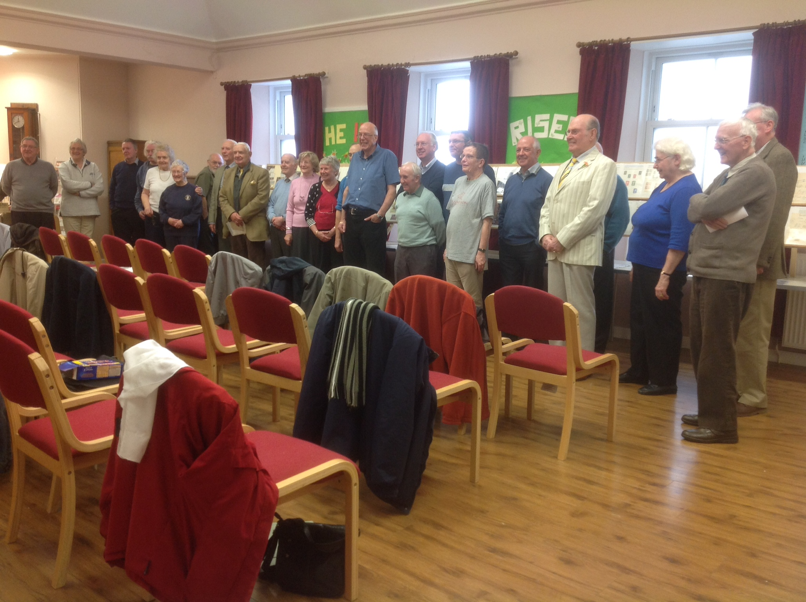
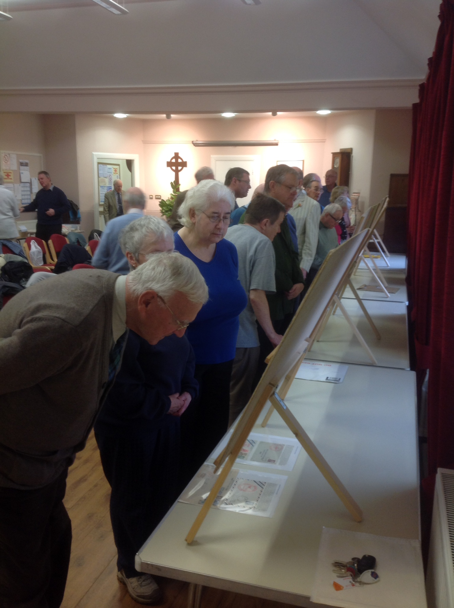

# Uddingston Stamp and Postcard Club
The Group celebrated 5 years of meetings on 13 October 2014. The Caledonian Philatelic Society was happy to subsidise the first meetings, however this has never been necessary as from humble beginnings, meetings now attract a regular attendance of 30+. There's no membership fee, those attending contribute £1 which covers tea/coffee and biscuits.

The club meets in the Park Church Hall off the main street, opposite the Uddingston Post Office. Uddingston is accessable by train and bus from the Glasgow area and from the nearby Lanarkshire towns. There are a couple of free car parks next to the Post Office and by Tunnock's Bakery via the Cross. On meeting days the doors are open from 9.30am for tea and coffee before the meeting begins about 10.0am.

Thanks to organisers Gordon and Wilma Shepherd for their outstanding contribution to the hobby in the West of Scotland.

Some of those attending the 5th Anniversary meeting. There are a few familiar faces there!

